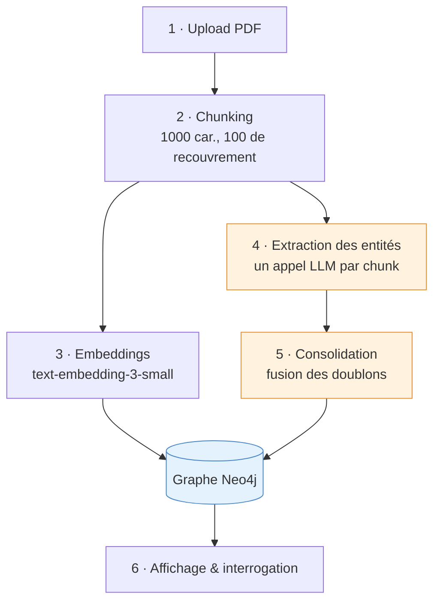
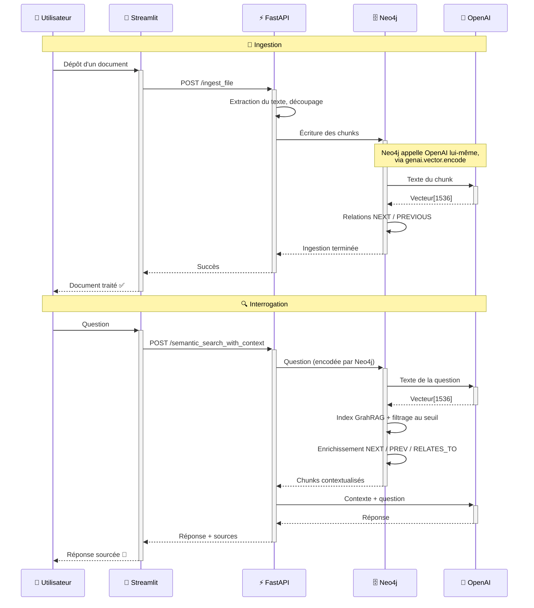

# 🕸️ GraphRAG Knowledge Graph

> **Des documents vers un graphe de connaissances interrogeable en langage naturel.**
>
> Neo4j (graphe + index vectoriel natif), OpenAI et Python. Deux chemins dans un même
> dépôt : une **démo autonome** qui construit un graphe d'entités à partir de PDF déposés,
> et une **plateforme API + interface** pour le RAG documentaire au quotidien.

[](https://python.org)
[](https://neo4j.com)
[](https://fastapi.tiangolo.com)
[](https://streamlit.io)

---

## 🎬 Les commandes à connaître

Tout part de l'environnement virtuel. **Aucune de ces commandes ne dépend des autres** —
la démo n'a besoin ni de l'API ni de l'interface du projet.

```bash
# ─── LA DÉMO (autonome) ────────────────────────────────────────────────────────
.venv/bin/python -m streamlit run demo_streamlit.py --server.port 8502  # interface
.venv/bin/python demo_build_kg.py                                       # pipeline en CLI
.venv/bin/python demo_query.py                                          # vectoriel vs graphe

# ─── LA PLATEFORME (API + interface) ───────────────────────────────────────────
cd KnowledgeGraphRagAPI && ../.venv/bin/python -m uvicorn main:app --reload --port 8000
.venv/bin/python -m streamlit run streamlit_rag_simple.py --server.port 8501
.venv/bin/python start.py        # ou les deux d'un coup, avec préflight
```

> **Windows** : remplacez `.venv/bin/python` par `.venv\Scripts\python.exe` partout.
>
> **Docker n'est pas nécessaire** : ces commandes s'exécutent en local, contre une base
> Neo4j distante. Le conteneur ne sert qu'au déploiement de la plateforme.

Le détail de chaque commande est en [§ Lancer la démo](#-lancer-la-démo) et
[§ Lancer la plateforme](#-lancer-la-plateforme). D'abord, l'installation.

---

## ⚡ Installation

### **1. Prérequis**

| | Détail |
|---|---|
| **Python 3.11+** | Impératif : `numpy 2.3` et `scipy 1.16` ne compilent pas en 3.10, et `start.py` refuse de démarrer en deçà |
| **Neo4j 5.x** | Avec **index vectoriel**. La plateforme exige en plus les fonctions **GenAI** (`genai.vector.encode`) et **GDS** (`gds.similarity.cosine`) ; la démo exige **APOC** (`apoc.refactor.mergeNodes`, `apoc.text.join`). Neo4j Aura fournit l'ensemble |
| **Clé OpenAI** | Embeddings + génération. La plateforme fait appeler OpenAI **par Neo4j** : la base doit avoir un accès sortant vers `api.openai.com` |

### **2. Environnement**

```bash
git clone https://github.com/famibelle/KnowledgeGraphRag.git
cd KnowledgeGraphRag

# Linux / macOS — uv télécharge CPython 3.11 au besoin
uv venv --python 3.11 .venv

# requirements.txt est un `pip freeze` réalisé sous Windows : il épingle pywin32,
# qui n'a pas de wheel ailleurs et fait échouer TOUT l'install. On le filtre.
grep -viE '^pywin32==' requirements.txt > /tmp/requirements.linux.txt
uv pip install --python .venv/bin/python -r /tmp/requirements.linux.txt
```

```powershell
# Windows — pas de filtrage nécessaire
py -3.11 -m venv .venv
.venv\Scripts\python.exe -m pip install -r requirements.txt
```

### **3. Configuration**

Copiez `.env.example` vers `.env` à la racine. **Cinq variables sont réellement lues** ;
les autres clés du fichier d'exemple (`CHUNK_SIZE`, `DEFAULT_TOP_K`, `MAX_WORKERS`…) ne
sont consommées par aucun code — les paramètres correspondants sont écrits en dur.

```env
NEO4J_URI=neo4j+s://votre-instance.databases.neo4j.io
NEO4J_USERNAME=neo4j
NEO4J_PASSWORD=votre_mot_de_passe
NEO4J_DATABASE=neo4j
OPENAI_API_KEY=sk-...
```

### **4. Index vectoriel**

Il n'existe **pas** d'endpoint d'initialisation : l'index se crée une fois, à la main,
depuis le Neo4j Browser.

```cypher
CREATE VECTOR INDEX GrahRAG IF NOT EXISTS
FOR (c:Chunk) ON (c.textEmbedding)
OPTIONS {indexConfig: {`vector.dimensions`: 1536, `vector.similarity_function`: 'cosine'}}
```

> ⚠️ Le nom `GrahRAG` porte une coquille — c'est le nom **réellement** attendu, codé en
> dur dans l'API et dans les scripts de démo. Ne le corrigez pas.

---

## 🎬 Lancer la démo

La démo répond à une question précise : *que gagne-t-on à extraire un **graphe d'entités**
plutôt qu'à empiler des chunks ?* Elle est bâtie sur
[`neo4j-graphrag`](https://neo4j.com/docs/neo4j-graphrag-python/), la librairie officielle
Neo4j, et calcule ses embeddings **côté Python** — à la différence de la plateforme.

### 1️⃣ L'interface de démo — le chemin recommandé en présentation

```bash
.venv/bin/python -m streamlit run demo_streamlit.py --server.port 8502
```

Ouvre `http://localhost:8502`. Le port 8502 évite la collision avec
`streamlit_rag_simple.py`, qui occupe 8501. Quatre pages, dans l'ordre d'une démonstration :

| Page | Contenu |
|---|---|
| **0 · La pipeline** | Le schéma de bout en bout, avec les deux seules étapes qui appellent le LLM |
| **1 · Déposer & construire** | Dépôt de fichiers, **un bouton** qui enchaîne toute la construction, gestion du corpus (avec retrait du disque *et* du graphe) |
| **2 · Le graphe** | Volumétrie, graphe interactif, et l'inventaire des entités **avec l'extrait de texte dont chacune provient** |
| **3 · Interroger** | Question → Cypher généré par le LLM → résultat → réponse. La requête est affichée. Zone Cypher libre en complément |

La barre latérale affiche l'état de connexion Neo4j et la volumétrie courante.
Comptez **~30 s par document** pour la construction.

### 2️⃣ La pipeline en ligne de commande

```bash
# Traite TOUS les fichiers du dossier PDFs/ — formats : .pdf, .txt, .md
.venv/bin/python demo_build_kg.py
```

Enchaîne découpage → embeddings → extraction des entités → consolidation, en traçant
chaque étape, puis imprime l'inventaire des types, des relations et le décompte
`chunks / embeddings`. **L'ingestion est incrémentale** : elle n'efface rien, relancer
le script sur un dossier enrichi ajoute au graphe existant.

C'est le module que l'interface importe : les deux chemins exécutent le même code.

### 3️⃣ L'interrogation comparée — la démonstration de valeur

```bash
.venv/bin/python demo_query.py
```

Pose trois questions à **deux systèmes montés sur le même index**, et imprime les réponses
côte à côte :

- `VectorRetriever` — le RAG vectoriel nu : les chunks les plus proches, rien d'autre ;
- `VectorCypherRetriever` — le même chunk, **étendu par le graphe** aux entités qui en sont
  issues puis à leurs voisines.

C'est l'écart entre les deux colonnes qui constitue la démonstration.

> Les trois questions sont écrites en dur dans `demo_query.py` et portent sur un
> référentiel de procédures (plafonds de remboursement, seuils d'approbation, procédure
> d'achat). **Adaptez-les à votre corpus** : posées à un graphe construit sur d'autres
> documents, elles n'ont pas de réponse.

📖 Pipeline détaillée, mesures et limites assumées : **[DEMO-GRAPHRAG.md](./DEMO-GRAPHRAG.md)**

---

## 🚀 Lancer la plateforme

Deux processus qui communiquent en HTTP. L'interface ne contient **aucune logique métier** :
elle ne fait qu'appeler les endpoints.

```bash
# API — À LANCER DEPUIS KnowledgeGraphRagAPI/. main.py charge `../.env`, chemin
# relatif au répertoire courant du processus : lancé d'ailleurs, il ne lit rien.
cd KnowledgeGraphRagAPI && ../.venv/bin/python -m uvicorn main:app --reload --port 8000

# Interface, dans un autre terminal, depuis la racine
.venv/bin/python -m streamlit run streamlit_rag_simple.py --server.port 8501
```

```bash
# Ou les deux d'un coup : contrôle version Python / .env / dépendances, puis lance
.venv/bin/python start.py
```

API sur `http://localhost:8000/docs`, interface sur `http://localhost:8501`.
`API_BASE_URL` est codé en dur à `http://localhost:8000` : les deux processus doivent
tourner sur la même machine.

**Diagnostic immédiat :**

```bash
curl -s http://localhost:8000/health
```

Une base injoignable renvoie `{"status":"unhealthy","neo4j":"error","error":"'NoneType'
object has no attribute 'query'"}`. Ce `NoneType` n'est pas un bug distinct : si Neo4j est
injoignable à l'import, la connexion vaut `None` et l'application démarre quand même.

### **Endpoints**

| Endpoint | Rôle |
|---|---|
| `POST /query` | Recherche vectorielle + réponse générée (gpt-4o-mini) |
| `POST /semantic_search_with_context` | Recherche vectorielle + enrichissement `NEXT`/`PREVIOUS`/`RELATES_TO` |
| `POST /ingest_file` | Ingestion d'un document (PDF, MD, DOCX, TXT) |
| `POST /smart_inter_document_relationships` | Construction des liens `RELATES_TO` (requiert GDS) |
| `GET /graph_structure/{filename}` · `GET /graph_stats` · `GET /db_info` | Exploration |
| `DELETE /document/{filename}` | Retrait d'un document et de ses chunks |
| `POST /cypher` | Cypher arbitraire, **sans aucune restriction** — surface de développement |
| `GET /` · `GET /health` | État du service |

Seuil de similarité par défaut : **0.9** sur `/query`, **0.8** sur
`/semantic_search_with_context`.

```bash
curl -X POST "http://localhost:8000/semantic_search_with_context" \
  -H "Content-Type: application/json" \
  -d '{"question": "résultats financiers", "top_k": 5, "similarity_threshold": 0.9}'
```

---

## 🏗️ Comment ça marche

### **Deux pipelines, un seul graphe**

Les deux chemins écrivent dans **la même base** et partagent **le même index vectoriel**.
Ils ne construisent pas la même chose.

| | 🎬 Démo (`demo_*.py`) | 🚀 Plateforme (`KnowledgeGraphRagAPI/`) |
|---|---|---|
| **Librairie** | `neo4j-graphrag` (`SimpleKGPipeline`) | LangChain + Cypher écrit à la main |
| **Embeddings calculés** | **en Python**, `text-embedding-3-small` | **dans Neo4j**, via `genai.vector.encode` |
| **Découpage** | 1000 caractères, 100 de recouvrement | 800 caractères, 80 de recouvrement |
| **Ce qui est extrait** | Un graphe d'**entités métier** typées | Des **chunks** reliés entre eux |
| **Interrogation** | Cypher généré par le LLM, ou étendu par le graphe | Recherche vectorielle + voisinage |
| **Dépendance** | Aucune : parle à Neo4j directement | Les deux processus, API puis interface |

> ⚠️ **Le point commun critique** : les deux côtés doivent produire des vecteurs dans le
> **même espace**. Neo4j utilise `ada-002` par défaut dans `genai.vector.encode` ; l'API le
> force donc explicitement à `text-embedding-3-small`. Sans cela, les deux modèles sortant
> tous deux en 1536 dimensions, **aucune erreur n'est levée** — la recherche compare
> simplement deux espaces vectoriels étrangers, et les scores s'effondrent.

### **La pipeline de la démo, en six étapes**


```mermaid
flowchart TD
    A["1 · Upload PDF"] --> B["2 · Chunking<br/>1000 car., 100 de recouvrement"]
    B --> C["3 · Embeddings<br/>text-embedding-3-small"]
    B --> D["4 · Extraction des entités<br/>un appel LLM par chunk"]
    D --> E["5 · Consolidation<br/>fusion des doublons"]
    C --> F[("Graphe Neo4j")]
    E --> F
    F --> G["6 · Affichage & interrogation"]

    classDef llm fill:#fff3e0,stroke:#e69138,color:#333
    classDef store fill:#e3f2fd,stroke:#4a86c8,color:#333
    class D,E llm
    class F store
```

En orange, les deux seules étapes qui appellent le LLM.

**Le parti pris de conception : consolider après, plutôt que contraindre avant.** Les
documents n'étant pas connus à l'avance, aucun schéma d'entités ne peut être écrit au
préalable. L'extraction est donc **libre** — le modèle nomme et type ce qu'il trouve — et le
nettoyage porte ensuite sur les entités réellement produites, en quatre passes dont
**trois sont déterministes** :

| Passe | Méthode | LLM |
|---|---|---|
| **0 · Nommage** | Chaque entité doit porter un `name` exploitable : reprise de `title`/`nom`/`label`… ; les entités sans aucune identité sont supprimées | non |
| **A · Fusion exacte** | Regroupement sur le nom normalisé (minuscules, sans accent, sans ponctuation, sans article), toutes étiquettes confondues, via `apoc.refactor.mergeNodes` | non |
| **B · Harmonisation** | Un unique appel qui associe chaque étiquette observée à une étiquette canonique | **oui** |
| **C · Fusion approchée** | `rapidfuzz`, similarité de noms ≥ 92, à étiquette égale | non |

La passe A opérant toutes étiquettes confondues, elle réunit « la Direction des Achats » et
« DIRECTION DES ACHATS » — et règle du même coup les doublons de type portant sur une même
entité.

### **Le workflow de la plateforme**


```mermaid
sequenceDiagram
    participant User as 👤 Utilisateur
    participant UI as 🎨 Streamlit
    participant API as ⚡ FastAPI
    participant Neo4j as 🗄️ Neo4j
    participant OpenAI as 🤖 OpenAI

    Note over User,OpenAI: 📄 Ingestion
    User->>+UI: Dépôt d'un document
    UI->>+API: POST /ingest_file
    API->>API: Extraction du texte, découpage
    API->>+Neo4j: Écriture des chunks
    Note over Neo4j,OpenAI: Neo4j appelle OpenAI lui-même,<br/>via genai.vector.encode
    Neo4j->>+OpenAI: Texte du chunk
    OpenAI-->>-Neo4j: Vecteur[1536]
    Neo4j->>Neo4j: Relations NEXT / PREVIOUS
    Neo4j-->>-API: Ingestion terminée
    API-->>-UI: Succès
    UI-->>-User: Document traité ✅

    Note over User,OpenAI: 🔍 Interrogation
    User->>+UI: Question
    UI->>+API: POST /semantic_search_with_context
    API->>+Neo4j: Question (encodée par Neo4j)
    Neo4j->>+OpenAI: Texte de la question
    OpenAI-->>-Neo4j: Vecteur[1536]
    Neo4j->>Neo4j: Index GrahRAG + filtrage au seuil
    Neo4j->>Neo4j: Enrichissement NEXT / PREV / RELATES_TO
    Neo4j-->>-API: Chunks contextualisés
    API->>+OpenAI: Contexte + question
    OpenAI-->>-API: Réponse
    API-->>-UI: Réponse + sources
    UI-->>-User: Réponse sourcée 🧠
```

Chaque appel Neo4j est synchrone (`langchain_neo4j.Neo4jGraph`) : l'API les enveloppe donc
systématiquement dans un exécuteur, un par appel.

```python
with ThreadPoolExecutor() as executor:
    result = await loop.run_in_executor(executor, kg.query, cypher, params)
```

C'est la convention à suivre pour tout nouvel endpoint.

---

## 🗄️ Modèle de données

### **Ce qu'écrit la plateforme**

```cypher
(:Document {filename, created_at, chunk_count, file_extension, file_size})
  -[:CONTAINS_CHUNK {chunk_index}]-> (:Chunk {id, filename, text, chunk_index, textEmbedding})

(:Chunk)-[:NEXT_CHUNK]->(:Chunk)          // et son miroir PREVIOUS_CHUNK
(:Chunk)-[:RELATES_TO {similarity, type, source_doc, target_doc, method}]->(:Chunk)
```

- `Chunk.id` vaut `"{filename}-{index}"` ; **`filename` est la clé de jointure partout**,
  il n'existe pas d'identifiant de document.
- La propriété est **`chunk_index`**, en snake_case.
- `RELATES_TO` est créée dans les **deux sens** : une correspondance non orientée
  compte double.

### **Ce qu'écrit la démo**

```cypher
(:Chunk)-[:FROM_DOCUMENT]->(:SourceDocument {filename, path, chunk_count})
(:__Entity__:TypeMétier {name, …})-[:FROM_CHUNK]->(:Chunk)
(:__Entity__)-[:TYPE_DÉCIDÉ_PAR_LE_LLM]->(:__Entity__)
```

Les étiquettes d'entités et les types de relations ne sont pas fixés à l'avance : ils
sortent de l'extraction libre, puis les étiquettes passent par l'harmonisation.
`__Entity__` est le label commun posé par la librairie, celui sur lequel s'appuient la
consolidation et toutes les requêtes ci-dessous.

Le sens est **inversé** par rapport à la plateforme, et le nœud de document porte un autre
label. En fin d'ingestion, `demo_build_kg.py` applique donc une projection de compatibilité
(constante `COMPAT`) qui renseigne `filename`, `chunk_index` et `id` sur les chunks et crée
les `CONTAINS_CHUNK` manquants.

> **Portée exacte de cette compatibilité** : les chunks de la démo deviennent visibles à la
> recherche vectorielle de l'API, qui interroge `(:Chunk)`. Les nœuds de document, eux,
> gardent le label `:SourceDocument` — les endpoints qui filtrent sur `(:Document)`
> (`/graph_stats`, `/graph_structure`, `DELETE /document`) **ne listeront pas les documents
> de la démo**.

Le point important du modèle de la démo : chaque entité conserve un lien `FROM_CHUNK` vers
le passage qui l'a produite, et de là vers son document. **Toute affirmation du graphe
remonte à une phrase du texte** — c'est ce que montre la page 2 de l'interface.

---

## 🔍 Explorer le graphe en Cypher

À exécuter dans le [Neo4j Browser](https://console-preview.neo4j.io/tools/query).

```cypher
// 📊 Volumétrie générale
MATCH (n) WITH labels(n) AS l, count(*) AS n UNWIND l AS label
RETURN label, sum(n) AS noeuds ORDER BY noeuds DESC;

// 📄 Documents et leurs chunks (plateforme)
MATCH (d:Document)-[:CONTAINS_CHUNK]->(c:Chunk)
RETURN d.filename, d.chunk_count, count(c) AS chunks_reels, d.created_at
ORDER BY d.created_at DESC;

// 🕸️ Navigation séquentielle dans un document
MATCH (d:Document {filename: 'votre-document.pdf'})-[:CONTAINS_CHUNK]->(c:Chunk)
OPTIONAL MATCH (c)-[:NEXT_CHUNK]->(suivant:Chunk)
RETURN c.chunk_index, substring(c.text, 0, 100) + '…' AS apercu,
       suivant.chunk_index AS suivant
ORDER BY c.chunk_index;

// 🌐 Relations sémantiques entre documents distincts
MATCH (c1:Chunk)-[r:RELATES_TO]->(c2:Chunk)
WHERE c1.filename <> c2.filename
RETURN c1.filename, c2.filename, r.similarity,
       substring(c1.text, 0, 80) AS extrait_1,
       substring(c2.text, 0, 80) AS extrait_2
ORDER BY r.similarity DESC LIMIT 20;

// 📊 Chunks les plus connectés — les pivots sémantiques
MATCH (c:Chunk)-[r:RELATES_TO]-()
WITH c, count(r) AS liens WHERE liens > 2
RETURN c.filename, c.chunk_index, liens, substring(c.text, 0, 100) AS apercu
ORDER BY liens DESC LIMIT 10;
```

**Côté démo — le graphe d'entités :**

```cypher
// 🏷️ Les types réellement produits par l'extraction, après consolidation
MATCH (n:__Entity__) UNWIND labels(n) AS l
WITH l WHERE NOT l STARTS WITH '__'
RETURN l AS type, count(*) AS entites ORDER BY entites DESC;

// 🔗 Les entités les plus reliées
MATCH (e:__Entity__)-[r]-(:__Entity__)
RETURN e.name AS entite, count(r) AS liens ORDER BY liens DESC LIMIT 15;

// 🧾 La provenance : de l'entité au texte qui l'a produite
MATCH (e:__Entity__)-[:FROM_CHUNK]->(c:Chunk)-[:FROM_DOCUMENT]->(d:SourceDocument)
RETURN e.name AS entite,
       [l IN labels(e) WHERE NOT l STARTS WITH '__'][0] AS type,
       d.filename AS source, substring(c.text, 0, 200) AS extrait
ORDER BY type, entite LIMIT 40;

// 🚫 Entités orphelines — n'ont plus de chunk source, donc plus de provenance
MATCH (e:__Entity__) WHERE NOT (e)-[:FROM_CHUNK]->()
RETURN e.name, labels(e);
```

**Conseils :** remplacez les noms de fichiers d'exemple par les vôtres, ajustez les `LIMIT`
à la taille du corpus, et servez-vous de `PROFILE` pour analyser une requête lente.

---

## 🐳 Docker (facultatif)

> **Docker n'est requis pour rien de ce qui précède.** Il ne sert qu'à *empaqueter* la
> plateforme pour la déployer ailleurs. La base de données, elle, est distante — une
> instance Neo4j Aura sous `neo4j+s://` — donc il n'y a rien à conteneuriser en local :
> l'installation de la § Installation et les commandes Python suffisent.

L'image lance **les deux processus** de la plateforme dans un seul conteneur
(`docker-start.sh` : uvicorn en arrière-plan, puis streamlit). Les scripts de démo ne sont
pas exposés par l'image.

```bash
# 1. Récupérer et remplir la configuration
curl -o .env.docker https://raw.githubusercontent.com/famibelle/KnowledgeGraphRag/master/.env.docker
nano .env.docker

# 2. Démarrer
docker run -d --name graphrag \
  -p 8000:8000 -p 8501:8501 \
  --env-file .env.docker \
  famibelle/graphrag-knowledge-graph:latest
```

Puis `http://localhost:8501`.

| Registry | Image |
|---|---|
| 🐳 Docker Hub | `famibelle/graphrag-knowledge-graph:latest` |
| 📦 GitHub | `ghcr.io/famibelle/knowledgegraphrag:latest` |

**Compose**, ou **build local** via le Makefile :

```bash
docker-compose -f docker-compose.production.yml up -d   # image publiée

make run     # build + up, exige .env.docker
make logs    # suivre les journaux
make health  # curl /health
make stop
```

Sous Docker il n'y a pas de `.env` : les variables viennent de `--env-file` ou de compose.
L'intégration continue construit amd64 + arm64 et publie sur `ghcr.io`.

---

## ☸️ DevOps & déploiement orchestré

> Les manifestes vivent dans **[`k8s/`](./k8s/)** — namespace, ConfigMap, Deployment,
> Service, Ingress, Route OpenShift et NetworkPolicy optionnelle, assemblés par
> `kustomization.yaml`. Trois valeurs sont à renseigner avant d'appliquer : `NEO4J_URI`,
> l'hôte public, et la version d'image. Il n'y a **pas** de chart Helm.

### **1. Ce que l'application impose à la plateforme**

À lire **avant** d'écrire le moindre YAML : quatre contraintes structurelles décident de la
topologie de déploiement, et aucune ne se contourne par configuration.

| Contrainte | Conséquence pour le déploiement |
|---|---|
| **Un conteneur, deux processus** (`docker-start.sh` : uvicorn puis streamlit) | Un seul `Deployment`, deux ports. On ne peut **pas** scinder en deux workloads : `API_BASE_URL` est codé en dur à `http://localhost:8000` dans `streamlit_rag_simple.py:16`. Les scinder exige de modifier le code |
| **Aucun état local** | Pas de `PersistentVolumeClaim`. Neo4j est **externe** (Aura). Le montage `./logs` de `docker-compose.production.yml` est décoratif : rien n'y est écrit |
| **Trois flux sortants** | Le pod doit joindre `neo4j+s://…:7687` et `api.openai.com:443`. Et l'instance **Neo4j** doit elle aussi joindre `api.openai.com` (c'est elle qui calcule les embeddings). Une `NetworkPolicy` en `default-deny` egress casse tout silencieusement |
| **Session Streamlit à état, sur websocket** | `replicas: 1`, ou affinité de session obligatoire. Sans elle, la montée en charge coupe les sessions au hasard |

**Le piège des sondes.** `GET /health` renvoie **toujours HTTP 200**, y compris quand Neo4j
est injoignable — l'état est dans le corps JSON (`"status": "unhealthy"`, cf.
`KnowledgeGraphRagAPI/main.py:1053`). Une `readinessProbe` en `httpGet` sur `/health` est
donc **inopérante** : elle ne échouera jamais. Même défaut dans le `HEALTHCHECK` du
Dockerfile, qui utilise `curl -f`. Pour une readiness qui a du sens, il faut lire le corps :

```yaml
readinessProbe:
  exec:
    command: ["sh", "-c", "curl -sf http://localhost:8000/health | grep -q '\"status\":\"healthy\"'"]
  initialDelaySeconds: 30
  periodSeconds: 15
livenessProbe:                    # le processus répond-il ? /  suffit et ne touche pas la base
  httpGet: { path: /, port: 8000 }
  initialDelaySeconds: 60
  periodSeconds: 30
```

Le démarrage est également strict : `docker-start.sh` sort en erreur si `OPENAI_API_KEY` ou
`NEO4J_URI` manquent, puis abandonne après 60 s d'attente de l'API. Un secret mal monté se
lit donc en `CrashLoopBackOff`, pas en erreur applicative — `kubectl logs` donne la ligne
exacte.

### **2. La chaîne d'intégration continue existante**

`.github/workflows/docker-publish.yml`, déclenché sur `master`/`main`, les tags `v*.*.*`,
les pull requests et manuellement :

| Étape | Détail |
|---|---|
| **Build multi-architecture** | `linux/amd64` + `linux/arm64` via Buildx, cache GitHub Actions |
| **Publication** | `ghcr.io/famibelle/knowledgegraphrag`, tags `latest`, `{version}`, `{major}.{minor}`, `{branch}-{sha}` |
| **Analyse de vulnérabilités** | Trivy, résultats poussés au format SARIF dans l'onglet Security |
| **Pull requests** | Build seul, **sans push** |

> ⚠️ **Les étapes Docker Hub sont commentées** dans le workflow. L'image
> `famibelle/graphrag-knowledge-graph` référencée par `docker-compose.production.yml` n'est
> donc **pas** alimentée par la CI. En production, tirez depuis `ghcr.io`. Pour réactiver
> Docker Hub : configurer les secrets `DOCKERHUB_USERNAME` / `DOCKERHUB_TOKEN` et
> décommenter les deux blocs.

**Ce que la CI ne fait pas** : aucun test (il n'y en a pas), aucun lint, aucun déploiement.
Le tag `latest` bouge à chaque commit sur `master` — en production, **épinglez un tag de
version ou un digest**, jamais `latest`.

### **3. Kubernetes**

Le dossier **[`k8s/`](./k8s/)** contient tout, assemblé par Kustomize :

| Fichier | Rôle | Dans `kustomization.yaml` |
|---|---|---|
| `namespace.yaml` · `configmap.yaml` | Le namespace, et `NEO4J_URI` / `NEO4J_USERNAME` / `NEO4J_DATABASE` | ✅ |
| `deployment.yaml` | Le pod, ses sondes, ses limites, `HOME=/tmp`, l'`emptyDir` de `/tmp` | ✅ |
| `service.yaml` | 8501 publié, 8000 réservé au `port-forward` | ✅ |
| `ingress.yaml` | Interface exposée, affinité de session, délais relevés | ✅ |
| `secret.example.yaml` | Modèle : `OPENAI_API_KEY`, `NEO4J_PASSWORD` | ❌ à créer hors dépôt |
| `networkpolicy.yaml` | Cloisonnement réseau | ❌ opt-in, à adapter au cluster |
| `openshift/route.yaml` | Remplace l'`Ingress` sur OpenShift | ❌ |

```bash
# 1. Le secret, hors du dépôt — lui seul porte ce qui est sensible
kubectl create namespace graphrag
kubectl -n graphrag create secret generic graphrag-secrets \
  --from-literal=OPENAI_API_KEY='sk-...' \
  --from-literal=NEO4J_PASSWORD='...'

# 2. Renseigner NEO4J_URI (configmap.yaml), l'hôte (ingress.yaml)
#    et la version d'image (kustomization.yaml)

# 3. Appliquer
kubectl apply -k k8s/
kubectl -n graphrag rollout status deploy/graphrag

# Le vrai diagnostic — /health répond 200 même en panne, il faut lire le corps
kubectl -n graphrag exec deploy/graphrag -- curl -s localhost:8000/health
```

Rappel : les autres clés de `.env.example` (`CHUNK_SIZE`, `DEFAULT_TOP_K`, `MAX_WORKERS`…)
ne sont lues par aucun code — inutile de les injecter.

> 🔒 **N'exposez que le port 8501.** L'Ingress ci-dessus ignore délibérément le 8000 :
> `POST /cypher` exécute **du Cypher arbitraire, écritures comprises, sans authentification**
> (cf. § Limites connues). Publier l'API, c'est publier la base. Le port 8000 reste dans le
> `Service` pour le diagnostic via `kubectl port-forward`, et l'interface l'atteint de toute
> façon par `localhost`, dans le conteneur.
>
> Si le registre est privé : `kubectl -n graphrag create secret docker-registry ghcr --docker-server=ghcr.io --docker-username=<user> --docker-password=<PAT>`, puis `imagePullSecrets: [{name: ghcr}]`.

### **4. Red Hat OpenShift**

Les manifestes de `k8s/` s'appliquent tels quels, à trois différences près — toutes issues
de la SCC `restricted-v2`, qui **ignore le `USER graphrag` du Dockerfile** et lance le
conteneur sous un **UID aléatoire** appartenant au groupe `root` (0).

| Point | Traitement |
|---|---|
| **UID aléatoire** | Le code est en lecture universelle et `docker-start.sh` en `755` : l'image démarre sans modification. Mais `HOME=/home/graphrag` **n'existe pas** (`useradd` sans `-m`) et l'UID n'est pas dans `/etc/passwd` — d'où le `HOME=/tmp` du manifeste, **obligatoire** ici, sans quoi Streamlit échoue à écrire sa configuration |
| **Pas de `Ingress` mais des `Route`** | Une `Route` ne cible **qu'un seul port**. Une route sur 8501, et c'est tout — ce qui est précisément ce qu'on veut |
| **Affinité de session** | Native : les routes OpenShift posent un cookie d'équilibrage par défaut. Rien à annoter |

```bash
oc new-project graphrag

oc create secret generic graphrag-secrets \
  --from-literal=OPENAI_API_KEY='sk-...' --from-literal=NEO4J_PASSWORD='...'
oc create configmap graphrag-config \
  --from-literal=NEO4J_URI='neo4j+s://...' \
  --from-literal=NEO4J_USERNAME='neo4j' --from-literal=NEO4J_DATABASE='neo4j'

# Tout sauf l'Ingress, remplacé par la Route
oc apply -f k8s/namespace.yaml -f k8s/configmap.yaml \
         -f k8s/deployment.yaml -f k8s/service.yaml

oc apply -f k8s/openshift/route.yaml     # TLS au routeur, redirection HTTP → HTTPS
oc -n graphrag get route graphrag -o jsonpath='{.spec.host}{"\n"}'
```

Diagnostic propre à la plateforme :

```bash
oc get events --sort-by=.lastTimestamp     # un refus de SCC apparaît ici, pas dans les logs
oc rsh deploy/graphrag id                  # confirme l'UID aléatoire et le groupe 0
oc logs deploy/graphrag | head -20         # les vérifications de docker-start.sh
```

> Si votre cluster impose `runAsNonRoot: true` **avec** une image à `USER` non numérique,
> le kubelet refuse de démarrer le conteneur (il ne peut pas prouver que `graphrag` n'est
> pas root). Deux issues : ajouter `runAsUser: 1001` au `securityContext` du pod, ou
> reconstruire l'image en remplaçant `USER graphrag` par son UID numérique dans le
> `Dockerfile`.

### **5. Azure**

Trois cibles, par ordre d'effort croissant. Dans les trois cas, l'image vient de `ghcr.io`
et Neo4j reste **hors d'Azure** (Aura) : c'est un déploiement d'application sans état.

**a. Azure Container Apps — le meilleur rapport effort/résultat.** Serverless, TLS et nom
de domaine fournis, mise à l'échelle gérée.

```bash
az containerapp env create -g graphrag-rg -n graphrag-env -l westeurope

az containerapp create -g graphrag-rg -n graphrag \
  --environment graphrag-env \
  --image ghcr.io/famibelle/knowledgegraphrag:latest \
  --target-port 8501 --ingress external \
  --min-replicas 1 --max-replicas 1 \
  --cpu 1 --memory 2Gi \
  --secrets openai-key='sk-...' neo4j-password='...' \
  --env-vars OPENAI_API_KEY=secretref:openai-key \
             NEO4J_PASSWORD=secretref:neo4j-password \
             NEO4J_URI='neo4j+s://...' NEO4J_USERNAME=neo4j NEO4J_DATABASE=neo4j \
             HOME=/tmp
```

> `--min-replicas 1` est délibéré : la mise à l'échelle à zéro tuerait les sessions
> Streamlit, et le démarrage à froid de l'image dépasse la minute. Si vous passez
> `--max-replicas` au-delà de 1, activez l'affinité :
> `az containerapp ingress sticky-sessions set -g graphrag-rg -n graphrag --affinity sticky`.
> Le port 8000 n'est **pas** exposé — et ne doit pas l'être.

**b. Azure Container Instances — la démonstration jetable.** Un conteneur, une IP publique,
facturé à la seconde. Aucune montée en charge, aucun TLS.

```bash
az container create -g graphrag-rg -n graphrag \
  --image ghcr.io/famibelle/knowledgegraphrag:latest \
  --cpu 1 --memory 2 --ports 8501 --dns-name-label graphrag-demo \
  --environment-variables NEO4J_URI='neo4j+s://...' NEO4J_USERNAME=neo4j \
                          NEO4J_DATABASE=neo4j HOME=/tmp \
  --secure-environment-variables OPENAI_API_KEY='sk-...' NEO4J_PASSWORD='...'
```

Accessible sur `http://graphrag-demo.westeurope.azurecontainer.io:8501`, **en clair** :
réservez-le à une démonstration sur données non sensibles.

**c. Azure Kubernetes Service — si le cluster existe déjà.** Le dossier `k8s/` s'applique
sans modification ; seul l'ingress change.

```bash
az aks get-credentials -g graphrag-rg -n mon-cluster
kubectl apply -k k8s/
```

Points de vigilance propres à AKS : l'add-on **Application Gateway Ingress Controller**
exige `appgw.ingress.kubernetes.io/` en préfixe d'annotation à la place de
`nginx.ingress.kubernetes.io/`, et les websockets de Streamlit demandent un
`request-timeout` relevé. Pour les secrets, préférez **Azure Key Vault** au `Secret`
Kubernetes, via le pilote CSI :

```bash
az aks enable-addons -g graphrag-rg -n mon-cluster --addons azure-keyvault-secrets-provider
```

**Registre.** `ghcr.io` convient parfaitement. Pour rapatrier l'image dans **Azure
Container Registry** — obligatoire si le cluster est privé, sans egress vers GitHub :

```bash
az acr import -n monacr --source ghcr.io/famibelle/knowledgegraphrag:latest \
  --image graphrag:1.0.0
az aks update -g graphrag-rg -n mon-cluster --attach-acr monacr
```

### **6. Ce qu'il reste à faire avant une vraie production**

Cette application est un **PoC** ; l'orchestrer ne la rend pas exploitable. Par ordre de
gravité :

| Manque | Pourquoi c'est bloquant |
|---|---|
| **Aucune authentification** | Ni l'interface ni l'API n'en ont. Toute exposition publique doit passer par une couche d'authentification en amont (OAuth2 Proxy, Azure AD / Entra ID sur Container Apps, `oauth-proxy` en side-car sur OpenShift) |
| **`POST /cypher` sans restriction** | Écriture et suppression comprises. Le port 8000 ne doit jamais franchir le cluster, et une `NetworkPolicy` en `default-deny` ingress sur 8000 vaut mieux qu'une promesse |
| **Aucun test dans la CI** | Rien ne barre la route à une régression. Une simple étape qui construit l'image et vérifie que `GET /` répond serait déjà un progrès |
| **Pas de télémétrie** | Aucune instrumentation Prometheus/OpenTelemetry. Le seul signal est `kubectl logs` et le corps de `/health` |
| **Secrets en variables d'environnement** | Lisibles par `kubectl describe pod` et dans toute image de diagnostic. Key Vault + CSI, ou l'équivalent, sur un déploiement sérieux |
| **`latest` comme tag** | Mouvant à chaque commit sur `master` : un redémarrage de pod peut changer de version sans que personne ne l'ait décidé |

---

## ⚠️ Limites connues

Elles sont mesurées et assumées ; les ignorer conduit à mal lire les résultats.

**L'extraction d'entités n'est pas déterministe.** Même à `temperature=0`, deux exécutions
sur le même corpus donnent des volumétries différentes (58 puis 61 entités sur un corpus de
test). Les valeurs métier, elles, restent stables. **Ne validez jamais une exécution sur un
décompte d'entités.**

**La négation n'est pas gérée.** « Ce seuil est supprimé » produit tout de même une entité
pour ce seuil.

**La fusion peut être trop agressive.** Deux entités distinctes portant un libellé générique
identique seront réunies : sur un corpus de test, les quatre lignes d'un tableau de plafonds
ont fusionné parce qu'elles s'appelaient toutes « Plafond par nuit ». Le seuil de la passe C
est réglable (`consolider_entites(seuil_flou=…)`).

**La traduction question → Cypher échoue parfois.** Le LLM produit du Cypher que Neo4j
refuse ; l'interface le signale et propose d'écrire la requête à la main.

**`POST /cypher` n'impose aucune restriction.** Il exécute le Cypher qu'on lui donne, en
écriture comprise. C'est le socle des vues graphe de l'interface, donc il ne peut pas être
simplement retiré — mais il n'a rien à faire sur une instance exposée.

**Il n'y a pas de suite de tests.** La vérification se fait à la main : `/health` pour la
configuration, `demo_build_kg.py` pour la volumétrie du graphe, `demo_query.py` pour
l'apport du graphe sur le vectoriel seul.

---

## 🐛 Dépannage

| Symptôme | Cause probable |
|---|---|
| `pip install` échoue sur `pywin32` | `requirements.txt` est un freeze Windows — filtrez la ligne (cf. § Installation) |
| L'API démarre mais `/health` renvoie `unhealthy` + `NoneType` | Neo4j injoignable à l'import ; vérifiez `NEO4J_URI` et les identifiants |
| L'API ignore le `.env` | Elle le charge via `../.env`, **relatif au répertoire courant** : lancez uvicorn depuis `KnowledgeGraphRagAPI/` |
| La recherche ne renvoie jamais rien | L'index `GrahRAG` n'existe pas, ou les embeddings ne sont pas dans `Chunk.textEmbedding` |
| Des résultats médiocres sans erreur | Deux modèles d'embedding différents des deux côtés — les vecteurs ne vivent pas dans le même espace |
| `Unknown function 'genai.vector.encode'` | Neo4j sans les fonctions GenAI, ou sans accès sortant vers `api.openai.com` |
| `Unknown procedure 'apoc.refactor.mergeNodes'` | APOC absent : la consolidation de la démo en dépend |
| `Unknown function 'gds.similarity.cosine'` | GDS absent : `/smart_inter_document_relationships` en dépend |
| Une requête Cypher renvoie `null` partout | Vous utilisez `chunkIndex` ; la propriété est `chunk_index` |
| Streamlit refuse de démarrer | Port déjà pris — la démo est sur 8502, l'interface du projet sur 8501 |

---

## 📁 Structure du projet

```
├── demo_streamlit.py            # 🎬 Démo — interface de présentation (port 8502)
├── demo_build_kg.py             # 🎬 Démo — pipeline : ingestion, consolidation, retrait
├── demo_query.py                # 🎬 Démo — vectoriel seul vs enrichi par le graphe
├── PDFs/                        # 🎬 Corpus lu par demo_build_kg.py (dossier ignoré par git)
│
├── KnowledgeGraphRagAPI/
│   └── main.py                  # 🚀 L'API entière, endpoints et Cypher compris
├── streamlit_rag_simple.py      # 🚀 Interface de la plateforme (port 8501)
├── start.py                     # 🚀 Lance les deux processus, avec préflight
│
├── Dockerfile · docker-*.yml    # Conteneurisation (plateforme uniquement)
├── k8s/                         # ☸️ Manifestes Kubernetes / OpenShift (Kustomize)
├── Makefile                     # run / logs / health / stop / clean
├── requirements.txt             # Dépendances communes (freeze Windows, 184 paquets)
└── .env.example                 # Modèle de configuration
```

**Fichiers à ne pas prendre pour argent comptant :** `KnowledgeGraphRagAPI/README.md`
documente des endpoints qui n'existent pas ; `streamlit_kg_interface.py` est une interface
plus riche mais périmée, jamais lancée ; `useful_embedding_queries.cypher` utilise
`chunkIndex` et renvoie donc du vide ; les deux notebooks sont exploratoires.

---

## 📚 Documentation

| Guide | Contenu |
|---|---|
| **[DEMO-GRAPHRAG.md](./DEMO-GRAPHRAG.md)** | 🎬 La démo en détail : pipeline, choix de conception, mesures, pièges de `neo4j-graphrag` |
| [QUICK-START.md](./QUICK-START.md) | 🚀 Déploiement Docker en deux minutes |
| [DOCKER.md](./DOCKER.md) | 🐳 Détails de la conteneurisation |
| [k8s/README.md](./k8s/README.md) | ☸️ Les manifestes : contenu, application, points de vigilance |
| [TROUBLESHOOTING.md](./TROUBLESHOOTING.md) | 🔧 Dépannage approfondi |
| [WINDOWS.md](./WINDOWS.md) | 🪟 Spécificités Windows |

---

*Une question, un problème ? [Issues GitHub](https://github.com/famibelle/KnowledgeGraphRag/issues)*
