# 🧠 GraphRAG Knowledge Graph System

> **Système intelligent de questions-réponses basé sur un graphe de connaissances**
> 
> Combine Neo4j, OpenAI et FastAPI pour créer un système RAG (Retrieval Augmented Generation) avancé avec recherche sémantique vectorielle et navigation contextuelle dans un graphe de connaissances.

[](https://python.org)
[](https://neo4j.com)
[](https://fastapi.tiangolo.com)
[](https://streamlit.io)

## 🚀 Fonctionnalités Clés

### 🔍 **Recherche Sémantique Avancée**
- **Embeddings vectoriels** via OpenAI (text-embedding-3-small, 1536 dimensions)
- **Index vectoriel Neo4j natif** pour une recherche sub-seconde
- **Seuils de similarité configurables** (0.7-0.9) pour éviter les résultats non pertinents
- **Support multilingue** optimisé pour le français

### 🕸️ **Graphe de Connaissances Intelligent**
- **Relations automatiques** entre chunks similaires (`RELATES_TO`)
- **Navigation séquentielle** dans les documents (`NEXT_CHUNK`, `PREVIOUS_CHUNK`)
- **Contexte enrichi** avec métadonnées des documents
- **Requêtes Cypher flexibles** pour l'exploration avancée

### 📚 **Ingestion Multi-Format**
- **Formats supportés** : PDF, Markdown, Word, Texte
- **Découpage intelligent** en chunks optimisés
- **Création automatique** du graphe de connaissances
- **Processing parallèle** pour les performances

### 🧠 **Génération LLM Contextuelle**
- **Integration ChatGPT-3.5-turbo** pour les réponses
- **Réponses contextualisées** basées sur les documents
- **Filtrage intelligent** pour éviter les hallucinations
- **Recherche multi-documents** pour des requêtes complexes

## 🏗️ Architecture Technique

### **Stack Technologique**

```mermaid
flowchart TB
    %% User Interface Layer
    subgraph "🎨 Interface Utilisateur"
        UI[Streamlit Frontend<br/>Port 8501]
        BROWSER[🌐 Navigateur Web]
    end
    
    %% API Layer
    subgraph "⚡ API Layer"
        API[FastAPI Backend<br/>Port 8000<br/>ThreadPoolExecutor]
        DOCS[📊 Swagger/ReDoc<br/>Auto-generated]
    end
    
    %% External Services
    subgraph "🤖 Services IA"
        OPENAI_EMB[OpenAI Embeddings<br/>text-embedding-3-small<br/>1536 dimensions]
        OPENAI_LLM[OpenAI LLM<br/>GPT-3.5-turbo<br/>Response Generation]
    end
    
    %% Database Layer
    subgraph "🗄️ Base de Données"
        NEO4J[Neo4j 5.x<br/>Graph + Vector DB]
        VECTOR_IDX[Vector Index<br/>GrahRAG<br/>Cosine Similarity]
        GRAPH_REL[Graph Relations<br/>NEXT/PREV/RELATES_TO]
    end
    
    %% Data Processing
    subgraph "📊 Traitement Documents"
        INGEST[Document Ingestion<br/>PDF/MD/DOCX/TXT]
        CHUNK[Text Chunking<br/>RecursiveCharacterTextSplitter]
        EMBED[Embedding Generation<br/>Parallel Processing]
    end
    
    %% Connections
    BROWSER --> UI
    UI <--> API
    API --> DOCS
    
    API <--> OPENAI_EMB
    API <--> OPENAI_LLM
    API <--> NEO4J
    
    NEO4J --> VECTOR_IDX
    NEO4J --> GRAPH_REL
    
    API --> INGEST
    INGEST --> CHUNK
    CHUNK --> EMBED
    EMBED --> NEO4J
    
    %% Styling
    classDef frontend fill:#e8f5e8,stroke:#2e7d32,stroke-width:2px
    classDef backend fill:#e3f2fd,stroke:#1565c0,stroke-width:2px
    classDef ai fill:#fff3e0,stroke:#ef6c00,stroke-width:2px
    classDef database fill:#fce4ec,stroke:#c2185b,stroke-width:2px
    classDef processing fill:#f3e5f5,stroke:#7b1fa2,stroke-width:2px
    
    class UI,BROWSER frontend
    class API,DOCS backend
    class OPENAI_EMB,OPENAI_LLM ai
    class NEO4J,VECTOR_IDX,GRAPH_REL database
    class INGEST,CHUNK,EMBED processing
```



**Architecture Technique :**
- **Frontend** : Streamlit (Python) - Interface web interactive
- **Backend** : FastAPI (Python async) - API REST haute performance
- **IA Services** : OpenAI (embeddings + LLM) - Traitement sémantique
- **Base de Données** : Neo4j 5.x - Graphe + index vectoriel natif
- **Performance** : ThreadPoolExecutor - Traitement parallèle optimisé

### **Modèle de Données Neo4j**

```mermaid
graph TD
    %% Nodes
    D1[📄 Document<br/>filename: string<br/>created_at: datetime<br/>file_extension: string<br/>chunk_count: integer]
    D2[📄 Document<br/>autre_doc.pdf]
    
    C1[📝 Chunk<br/>text: string<br/>textEmbedding: vector 1536D<br/>chunkIndex: integer<br/>filename: string<br/>created_at: datetime]
    C2[📝 Chunk<br/>chunk_suivant]
    C3[📝 Chunk<br/>chunk_précédent]
    C4[📝 Chunk<br/>chunk_similaire]
    C5[📝 Chunk<br/>autre_doc_chunk]
    
    %% Relations hiérarchiques
    D1 -.->|CONTAINS_CHUNK| C1
    D1 -.->|CONTAINS_CHUNK| C2
    D1 -.->|CONTAINS_CHUNK| C3
    D2 -.->|CONTAINS_CHUNK| C5
    
    %% Relations séquentielles (navigation dans le document)
    C3 -->|NEXT_CHUNK| C1
    C1 -->|NEXT_CHUNK| C2
    C1 -->|PREVIOUS_CHUNK| C3
    C2 -->|PREVIOUS_CHUNK| C1
    
    %% Relations sémantiques (inter et intra-documents)
    C1 -.->|RELATES_TO<br/>similarity: 0.87| C4
    C1 -.->|RELATES_TO<br/>similarity: 0.82| C5
    C4 -.->|RELATES_TO<br/>similarity: 0.85| C2
    
    %% Styling
    classDef documentNode fill:#e1f5fe,stroke:#01579b,stroke-width:2px
    classDef chunkNode fill:#f3e5f5,stroke:#4a148c,stroke-width:2px
    classDef sequentialRel stroke:#2e7d32,stroke-width:3px
    classDef semanticRel stroke:#d84315,stroke-width:2px,stroke-dasharray: 5 5
    classDef hierarchicalRel stroke:#424242,stroke-width:2px,stroke-dasharray: 10 5
    
    class D1,D2 documentNode
    class C1,C2,C3,C4,C5 chunkNode
```



**Légende du Modèle :**
- 📄 **Document** : Fichier source ingéré (PDF, MD, DOCX, TXT)
- 📝 **Chunk** : Fragment de texte avec embedding vectoriel (1536D)
- **CONTAINS_CHUNK** : Relation hiérarchique document → chunks
- **NEXT_CHUNK / PREVIOUS_CHUNK** : Navigation séquentielle dans le document
- **RELATES_TO** : Relations sémantiques inter/intra-documents (similarity > 0.8)

### **🔍 Requêtes Cypher d'Exploration**

**Pour explorer votre graphe dans [Neo4j Browser](https://console-preview.neo4j.io/tools/query) :**

```cypher
// 📊 Vue d'ensemble du graphe complet
MATCH (d:Document)-[r]-(c:Chunk)
RETURN d, r, c
LIMIT 50;

// 📈 Statistiques générales du Knowledge Graph
MATCH (d:Document) 
WITH count(d) as documents
MATCH (c:Chunk) 
WITH documents, count(c) as chunks
MATCH ()-[r]->() 
RETURN documents, chunks, count(r) as total_relations;

// 🔗 Relations par type avec comptage
MATCH ()-[r]->() 
RETURN type(r) as relation_type, count(r) as count 
ORDER BY count DESC;

// 📄 Documents avec leurs chunks et métadonnées
MATCH (d:Document)-[:CONTAINS_CHUNK]->(c:Chunk)
RETURN d.filename, d.chunk_count, d.created_at, 
       count(c) as actual_chunks, 
       collect(c.chunkIndex)[0..3] as first_chunks
ORDER BY d.created_at DESC;

// 🕸️ Navigation séquentielle dans un document
MATCH (d:Document {filename: 'your-document.pdf'})-[:CONTAINS_CHUNK]->(c:Chunk)
OPTIONAL MATCH (c)-[:NEXT_CHUNK]->(next:Chunk)
OPTIONAL MATCH (c)-[:PREVIOUS_CHUNK]->(prev:Chunk)
RETURN c.chunkIndex, c.text[0..100] + '...' as preview,
       prev.chunkIndex as previous, next.chunkIndex as next
ORDER BY c.chunkIndex;

// 🌐 Relations sémantiques inter-documents
MATCH (c1:Chunk)-[r:RELATES_TO]->(c2:Chunk)
WHERE c1.filename <> c2.filename
RETURN c1.filename, c2.filename, r.similarity,
       c1.text[0..80] + '...' as chunk1_preview,
       c2.text[0..80] + '...' as chunk2_preview
ORDER BY r.similarity DESC
LIMIT 20;

// 🔍 Recherche textuelle simple
MATCH (c:Chunk)
WHERE toLower(c.text) CONTAINS toLower('votre_terme_recherche')
RETURN c.filename, c.chunkIndex, c.text[0..150] + '...' as preview
LIMIT 10;

// 📊 Chunks les plus connectés (hubs sémantiques)
MATCH (c:Chunk)-[r:RELATES_TO]-()
WITH c, count(r) as connections
WHERE connections > 2
RETURN c.filename, c.chunkIndex, connections,
       c.text[0..100] + '...' as preview
ORDER BY connections DESC
LIMIT 10;

// 🎯 Analyse de qualité des embeddings
MATCH (c:Chunk)
WHERE c.textEmbedding IS NULL
RETURN count(c) as chunks_without_embeddings;

// 🔄 Chemins entre deux documents spécifiques  
MATCH path = shortestPath(
  (d1:Document {filename: 'doc1.pdf'})-[*]-(d2:Document {filename: 'doc2.pdf'})
)
RETURN path, length(path) as path_length;

// 📋 Métadonnées complètes d'un chunk spécifique
MATCH (c:Chunk {filename: 'your-doc.pdf', chunkIndex: 0})
OPTIONAL MATCH (c)-[r1:RELATES_TO]->(related:Chunk)
OPTIONAL MATCH (c)-[r2:NEXT_CHUNK]->(next:Chunk)
OPTIONAL MATCH (c)-[r3:PREVIOUS_CHUNK]->(prev:Chunk)
RETURN c, 
       collect(DISTINCT related.filename) as related_docs,
       next.chunkIndex as next_chunk,
       prev.chunkIndex as prev_chunk;
```

### **🎯 Requêtes Cypher Avancées**

```cypher
// 🧠 Simulation de recherche vectorielle manuelle
MATCH (c:Chunk)
WITH c, gds.similarity.cosine(
    c.textEmbedding, 
    [/* insérer votre vecteur de 1536 dimensions ici */]
) AS similarity
WHERE similarity > 0.8
RETURN c.filename, c.text[0..150] + '...' as preview, similarity
ORDER BY similarity DESC
LIMIT 5;

// 🌍 Analyse de clustering sémantique
CALL gds.louvain.stream({
  nodeProjection: 'Chunk',
  relationshipProjection: {
    RELATES_TO: {
      type: 'RELATES_TO',
      orientation: 'UNDIRECTED',
      properties: 'similarity'
    }
  }
}) YIELD nodeId, communityId
WITH gds.util.asNode(nodeId) AS chunk, communityId
RETURN communityId, 
       collect(DISTINCT chunk.filename) as documents,
       count(chunk) as chunks_in_cluster,
       collect(chunk.text[0..50])[0..3] as sample_texts
ORDER BY chunks_in_cluster DESC;

// � Analyse de densité du graphe par document
MATCH (d:Document)-[:CONTAINS_CHUNK]->(c:Chunk)
OPTIONAL MATCH (c)-[r:RELATES_TO]-()
WITH d, count(DISTINCT c) as chunks, count(r) as relations
RETURN d.filename, chunks, relations, 
       CASE WHEN chunks > 1 
            THEN round((relations * 1.0) / (chunks * (chunks-1)) * 100, 2) 
            ELSE 0 END as density_percentage
ORDER BY density_percentage DESC;

// 🔗 Détection de chunks "pont" entre documents
MATCH (c:Chunk)-[:RELATES_TO]-(other:Chunk)
WHERE c.filename <> other.filename
WITH c, collect(DISTINCT other.filename) as connected_docs
WHERE size(connected_docs) > 2
RETURN c.filename, c.chunkIndex, connected_docs,
       c.text[0..100] + '...' as bridge_content
ORDER BY size(connected_docs) DESC;

// 📈 Évolution temporelle de l'ingestion
MATCH (d:Document)
WITH d.created_at.year as year, d.created_at.month as month, count(d) as docs
RETURN year, month, docs
ORDER BY year, month;

// 🎯 Recherche par proximité sémantique (k-NN manuel)
MATCH (target:Chunk {filename: 'your-doc.pdf', chunkIndex: 0})
MATCH (c:Chunk)
WHERE c <> target
WITH c, gds.similarity.cosine(target.textEmbedding, c.textEmbedding) as similarity
ORDER BY similarity DESC
LIMIT 10
RETURN c.filename, c.chunkIndex, similarity,
       c.text[0..120] + '...' as similar_content;
```

**�💡 Conseils d'utilisation :**
- **Neo4j Browser** : https://console-preview.neo4j.io/tools/query
- Remplacez `'your-document.pdf'` par vos vrais noms de fichiers  
- Ajustez les `LIMIT` selon la taille de votre corpus
- Utilisez `PROFILE` ou `EXPLAIN` pour analyser les performances
- Les résultats s'affichent en mode graphique interactif
- **GDS (Graph Data Science)** requis pour les algorithmes avancés

### **Workflow GraphRAG**

```mermaid
sequenceDiagram
    participant User as 👤 Utilisateur
    participant UI as 🎨 Streamlit
    participant API as ⚡ FastAPI
    participant Neo4j as 🗄️ Neo4j
    participant OpenAI as 🤖 OpenAI
    
    %% Phase 1: Ingestion de Document
    Note over User,OpenAI: 📄 Phase 1: Ingestion de Document
    User->>+UI: Upload Document (PDF/MD/DOCX)
    UI->>+API: POST /ingest_file
    API->>API: Parse & Chunk Document
    API->>+OpenAI: Generate Embeddings
    OpenAI-->>-API: Vector[1536] per chunk
    API->>+Neo4j: Store Chunks + Embeddings
    Neo4j->>Neo4j: Create NEXT/PREV Relations
    Neo4j-->>-API: Ingestion Complete
    API-->>-UI: Success Response
    UI-->>-User: Document Processed ✅
    
    %% Phase 2: Construction Relations
    Note over User,OpenAI: 🕸️ Phase 2: Construction Relations Sémantiques
    User->>+UI: Build Inter-doc Relations
    UI->>+API: POST /smart_inter_document_relationships
    API->>+Neo4j: Find Similar Chunks (cosine > 0.8)
    Neo4j->>Neo4j: Create RELATES_TO Relations
    Neo4j-->>-API: Relations Created
    API-->>-UI: Graph Enhanced ✅
    UI-->>-User: Knowledge Graph Ready 🕸️
    
    %% Phase 3: Recherche Intelligente  
    Note over User,OpenAI: 🔍 Phase 3: Recherche Contextuelle
    User->>+UI: Ask Question
    UI->>+API: POST /semantic_search_with_context
    API->>+OpenAI: Embed Question
    OpenAI-->>-API: Question Vector[1536]
    API->>+Neo4j: Vector Search + Graph Traversal
    Neo4j->>Neo4j: Find Similar Chunks (threshold > 0.9)
    Neo4j->>Neo4j: Enrich with NEXT/PREV/RELATES_TO
    Neo4j-->>-API: Contextualized Chunks
    API->>+OpenAI: Generate Answer with Context
    OpenAI-->>-API: Intelligent Response
    API-->>-UI: Enhanced Results
    UI-->>-User: Answer + Sources + Context 🧠
```



**Étapes Détaillées :**

1. **📄 Ingestion** : Document → Parsing → Chunking → Embeddings → Neo4j Storage
2. **🕸️ Relations** : Analyse similarité → Création liens sémantiques → Graphe enrichi  
3. **🔍 Recherche** : Question → Vector Search → Filtrage seuil → Enrichissement contexte
4. **✨ Génération** : Contexte étendu → LLM → Réponse intelligente avec sources

## ⚡ Installation Rapide

### **1. Prérequis**
- Python 3.11+
- Neo4j 5.x avec support vectoriel
- Clé API OpenAI
- Git

### **2. Clone & Setup**
```bash
git clone https://github.com/famibelle/KnowledgeGraphRag.git
cd KnowledgeGraphRag

# Créer l'environnement virtuel
python -m venv .venv
.venv\Scripts\activate  # Windows
# source .venv/bin/activate  # Linux/Mac

# Installer les dépendances
pip install -r requirements.txt
```

### **3. Configuration Environnement**
```bash
# Copier le fichier d'exemple
copy .env.example .env

# Éditer .env avec vos paramètres
```

**Contenu `.env` requis :**
```env
# OpenAI Configuration
OPENAI_API_KEY=your_openai_api_key_here

# Neo4j Configuration
NEO4J_URI=neo4j+s://your-instance.databases.neo4j.io
NEO4J_USERNAME=neo4j
NEO4J_PASSWORD=your_neo4j_password
NEO4J_DATABASE=neo4j
```

### **4. Initialisation Neo4j**
```bash
# Démarrer l'API
cd KnowledgeGraphRagAPI
python -m uvicorn main:app --reload

# Dans un autre terminal : Initialiser la base
curl -X POST "http://localhost:8000/initialize_db"
```

### **5. Lancement Interface**
```bash
# Dans le répertoire racine
streamlit run streamlit_rag_simple.py
```

## 📖 Utilisation

### **Interface Web (Recommandée)**
1. Ouvrir `http://localhost:8501` (Streamlit)
2. **📤 Onglet "Gestion Documents"** : Upload vos fichiers
3. **🔍 Onglet "Recherche RAG"** : Poser vos questions
4. **🕸️ Onglet "Graphe"** : Explorer les relations

### **API REST**
Documentation interactive : `http://localhost:8000/docs`

**Endpoints principaux :**
- `POST /ingest_file` - Ingestion de documents
- `POST /semantic_search_with_context` - Recherche avec contexte graphique
- `POST /query` - Recherche avec réponse LLM
- `GET /graph_stats` - Statistiques du graphe

### **Exemple API**
```bash
# Recherche contextuelle
curl -X POST "http://localhost:8000/semantic_search_with_context" \
  -H "Content-Type: application/json" \
  -d '{
    "question": "résultats financiers LuxConnect",
    "top_k": 5,
    "similarity_threshold": 0.9
  }'
```

## 🧩 Architecture Détaillée

### **1. Recherche Sémantique Hybride**
Notre approche unique combine :
- **Recherche vectorielle** : Similarité cosinus sur embeddings 1536D
- **Filtrage par seuil** : Élimination automatique des résultats non pertinents
- **Enrichissement contextuel** : Navigation dans les relations du graphe
- **Métadonnées dynamiques** : Informations sur les documents sources

### **2. Parallel Processing Optimisé**
```python
# Exemple d'implémentation
with ThreadPoolExecutor() as executor:
    result = await loop.run_in_executor(
        executor,
        kg.query,  # Requête Neo4j
        cypher_query,
        parameters
    )
```

**Avantages :**
- ⚡ **22+ opérations parallélisées** dans le code
- 🚀 **Performance sub-seconde** pour la plupart des requêtes
- 🔄 **Traitement asynchrone** des embeddings et requêtes

### **3. Gestion Intelligente des Relations**
```cypher
-- Création automatique de relations sémantiques
MATCH (c1:Chunk), (c2:Chunk)
WHERE c1.filename <> c2.filename 
  AND gds.similarity.cosine(c1.textEmbedding, c2.textEmbedding) > 0.85
CREATE (c1)-[:RELATES_TO {score: similarity}]->(c2)
```

### **4. Stratégies de Filtrage Avancées**
- **Seuil dynamique** : Adaptation selon le contexte
- **Filtrage multi-niveaux** : Score + pertinence sémantique
- **Prévention des hallucinations** : Pas de réponse sans contexte valide

## 🔧 Configuration Avancée

### **Paramètres de Performance**
```python
# Dans main.py - Ajustement des seuils
similarity_threshold: float = Field(
    default=0.9,
    ge=0.1, le=1.0,
    description="Seuil de similarité (0.9=très pertinent, 0.7=recherche large)"
)
```

### **Optimisation Neo4j**
```cypher
-- Index vectoriel (créé automatiquement)
CREATE VECTOR INDEX GrahRAG FOR (c:Chunk) ON (c.textEmbedding)
OPTIONS {indexConfig: {
  `vector.dimensions`: 1536,
  `vector.similarity_function`: 'cosine'
}}
```

## 🧪 Tests et Validation

### **Tests de Robustesse**
```bash
python test_api_robustness.py  # Tests automatisés API
python test_parallel_efficiency.py  # Performance parallèle
```

### **Exemples de Requêtes**
- **Mono-document** : "Quels sont les résultats financiers de LuxConnect?"
- **Multi-documents** : "LuxConnect financials et TMD utilisation IA friction"
- **Contextuelle** : "Comment l'innovation technologique impacte les performances?"

## 📊 Métriques de Performance

### **Benchmarks Typiques**
- **Recherche vectorielle** : < 100ms sur 10K+ chunks
- **Génération LLM** : 2-5 secondes selon la complexité
- **Ingestion document** : 30-60 secondes selon la taille
- **Relations inter-documents** : 1-3 minutes selon le corpus

### **Capacités Scalabilité**
- ✅ **Millions de chunks** supportés (index vectoriel Neo4j)
- ✅ **Centaines de documents** simultanés
- ✅ **Requêtes parallèles** sans dégradation

### **🔧 Maintenance et Surveillance Neo4j**

**Requêtes de maintenance à exécuter régulièrement :**

```cypher
// 📈 Santé générale du graphe
CALL db.stats.retrieve('GRAPH COUNTS') YIELD data
RETURN data;

// 🗂️ Informations sur les index vectoriels
SHOW INDEXES 
WHERE type = 'VECTOR'
YIELD name, state, populationPercent, type;

// 📊 Analyse de l'utilisation mémoire
CALL dbms.queryJmx('java.lang:type=Memory') 
YIELD attributes 
RETURN attributes.HeapMemoryUsage, attributes.NonHeapMemoryUsage;

// 🔍 Performance des requêtes lentes
CALL db.stats.retrieve('QUERIES') YIELD data
UNWIND data.queries as query
WHERE query.elapsedTimeMillis > 1000
RETURN query.query, query.elapsedTimeMillis, query.executionCount
ORDER BY query.elapsedTimeMillis DESC
LIMIT 10;

// 🧹 Nettoyage : Supprimer chunks sans embeddings
MATCH (c:Chunk)
WHERE c.textEmbedding IS NULL
DELETE c;

// 🔄 Re-création de l'index vectoriel (si nécessaire)
DROP INDEX GrahRAG IF EXISTS;
CREATE VECTOR INDEX GrahRAG FOR (c:Chunk) ON (c.textEmbedding)
OPTIONS {indexConfig: {
  `vector.dimensions`: 1536,
  `vector.similarity_function`: 'cosine'
}};

// 📋 Backup des métadonnées importantes
MATCH (d:Document)
RETURN d.filename, d.created_at, d.chunk_count, d.file_extension
ORDER BY d.created_at DESC;
```

## 🤝 Contribution

### **Structure du Projet**
```
├── KnowledgeGraphRagAPI/     # Backend FastAPI
│   ├── main.py              # API principale
│   └── requirements.txt     # Dépendances backend
├── streamlit_rag_simple.py  # Interface Streamlit
├── requirements.txt         # Dépendances globales
├── .env.example            # Template configuration
└── README.md               # Cette documentation
```

### **Développement Local**
1. Fork le repository
2. Créer une branche feature : `git checkout -b feature/amazing-feature`
3. Tester localement avec Neo4j + OpenAI
4. Commit : `git commit -m 'Add amazing feature'`
5. Push : `git push origin feature/amazing-feature`
6. Ouvrir une Pull Request

## 🐛 Dépannage

### **Problèmes Courants**
- **Neo4j connexion** : Vérifier `.env` et URL/credentials
- **OpenAI API** : Valider la clé API et quotas
- **Import errors** : `pip install -r requirements.txt`
- **Performance lente** : Vérifier l'index vectoriel Neo4j

### **Logs et Debug**
```bash
# Activer les logs détaillés
export LOG_LEVEL=DEBUG
python -m uvicorn main:app --log-level debug
```

## 📝 License

MIT License - Voir [LICENSE](LICENSE) pour les détails.

## 🙏 Remerciements

- **Neo4j** pour la technologie graphe + vectorielle
- **OpenAI** pour les embeddings et LLM
- **FastAPI** & **Streamlit** pour les frameworks
- **LangChain** pour l'intégration élégante

---

**🚀 Prêt à explorer vos documents avec l'IA ? Commencez dès maintenant !**

*Pour plus d'aide : [Issues GitHub](https://github.com/famibelle/KnowledgeGraphRag/issues)*
